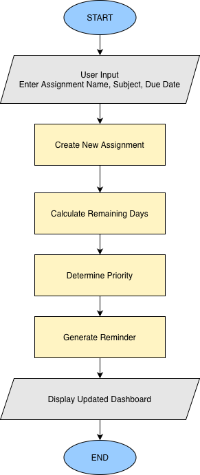

# SmartRemind: Assignment Reminder AI Agent

## Overview

SmartRemind is a Reflex-based Assignment Reminder AI Agent designed to help students manage academic deadlines more effectively. The system tracks assignments, calculates urgency levels based on due dates, generates contextual reminders, and provides a dashboard for monitoring upcoming and overdue tasks.

The goal of SmartRemind is to reduce missed deadlines and improve student time management through automated deadline awareness and assignment prioritization.

---
## Flowchart



---

## Features

### Assignment Management

* Add new assignments
* Delete assignments
* Mark assignments as completed

### Deadline Monitoring

* Automatic due date tracking
* Remaining days calculation
* Overdue assignment detection

### Priority Classification

Assignments are automatically categorized into:

* Overdue
* Due Today
* Due Tomorrow
* Upcoming

### Reminder Generation

The system generates contextual reminders based on assignment urgency.

Examples:

* Assignment overdue
* Due today
* Due tomorrow
* X days remaining

### Dashboard Analytics

* Total assignments
* Overdue assignments
* Upcoming assignments

### Organization Tools

* Filter assignments by subject
* Sort assignments by due date


---
## Tools and Libraries

This project uses the following tools and libraries:

### Programming Language
* Python 3.13 – Main language used to develop the backend logic and core functionality of the system.

### Web Framework
* Reflex (v0.9.4) – A Python-based full-stack framework used to build the user interface and connect frontend with backend logic.

### Data Validation
* Pydantic – Used to define structured data models and ensure input validation for assignments.

### Standard Libraries
* datetime – Used for handling dates and calculating deadlines.
* typing (List) – Used for type hinting and improving code clarity and structure.

---

## System Architecture

The application follows a layered architecture:

1. User Input
2. Assignment Processing
3. Priority & Urgency Engine
4. Reminder Generation
5. Dashboard & Visualization 


Core functionality includes:

* Automatic deadline monitoring
* Dynamic urgency calculation
* Reminder generation
* Assignment prioritization

---

## Technology Stack

### Frontend

* Reflex 0.9.4

### Backend

* Python 3.13

### Data Model

* Pydantic

---

## Installation

### Clone the Repository

```bash
git clone https://github.com/YOUR_USERNAME/smartremind_reflex.git
cd smartremind_reflex
```

### Install Dependencies

```bash
pip install -r requirements.txt
```

### Run the Application

```bash
reflex run
```

The application will be available at:

```text
http://localhost:3000
```


---

## Screenshots

### Dashboard


---
## License

This project is licensed under the MIT License.

The MIT License is a permissive open-source license that allows others to use, copy, modify, merge, publish, distribute, sublicense, and/or sell copies of the software, provided that the original license and copyright notice are included.

See the `LICENSE` file for more details.
---

## Author

Siti Aisyah binti Rajim

